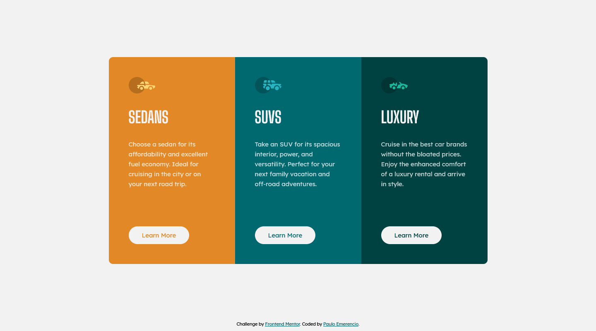

# Frontend Mentor - 3-column preview card component solution

This is a solution to the [3-column preview card component challenge on Frontend Mentor](https://www.frontendmentor.io/challenges/3column-preview-card-component-pH92eAR2-). Frontend Mentor challenges help you improve your coding skills by building realistic projects. 

## Table of contents

- [Overview](#overview)
  - [The challenge](#the-challenge)
  - [Screenshot](#screenshot)
  - [Links](#links)
- [My process](#my-process)
  - [Built with](#built-with)
  - [What I learned](#what-i-learned)
  - [Continued development](#continued-development)
  - [Useful resources](#useful-resources)
- [Author](#author)
- [Acknowledgments](#acknowledgments)

## Overview

### The challenge

Users should be able to:

- View the optimal layout depending on their device's screen size
- See hover states for interactive elements

### Screenshot of my solution



### Links

- Solution URL: [Click to see my solution working!](https://paulo-emerencio.github.io/3-column-preview-card-component/)

## My process

### Built with

- Semantic HTML5 markup
- Sass
- Flexbox

### What I learned

This was my first time using Sass on a project, so basically, I learned Sass.

Here is some code that makes me proud of myself:

```scss
// _mixins.scss
@mixin responsive($size) {
   @media(max-width: $size) {
      @content
   }
}
```

```scss
// _variables.scss
$cards-map: (
   sedans: $bright-orange,
   suvs: $dark-cyan,
   luxury: $very-dark-cyan,
);
```
```scss
// _cards.scss
@each $class, $color in $cards-map {
   .#{$class} {
      background-color: $color;

      @if $class == sedans {
         border-radius: 10px 0 0 10px;
      }
      @if $class == luxury {
         border-radius: 0 10px 10px 0;
      }

      @include responsive($mobile-size) {
         @if $class == sedans {
            border-radius: 10px 10px 0 0;
         }
         @if $class == luxury {
            border-radius: 0 0 10px 10px;
         }
      }

      a { color: $color; }
   }
}
```

### Continued development

I will focus now on improving my Sass abilities and learn APIs. 

### Useful resources

- [Sass official documentation](https://sass-lang.com/documentation) - Official documentations will always be helpful.

## Author

- Frontend Mentor - [@Paulo-Emerencio](https://www.frontendmentor.io/profile/Paulo-Emerencio)
- Digital Innovation One - [@p_emerencio](https://web.digitalinnovation.one/users/p_emerencio?tab=achievements)

## Acknowledgments

Once again [Kevin Powell](https://www.youtube.com/kepowob) helped me a lot with his sass videos on youtube.
